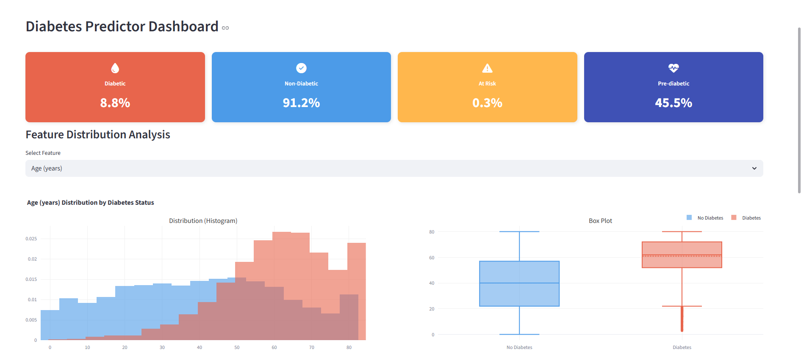
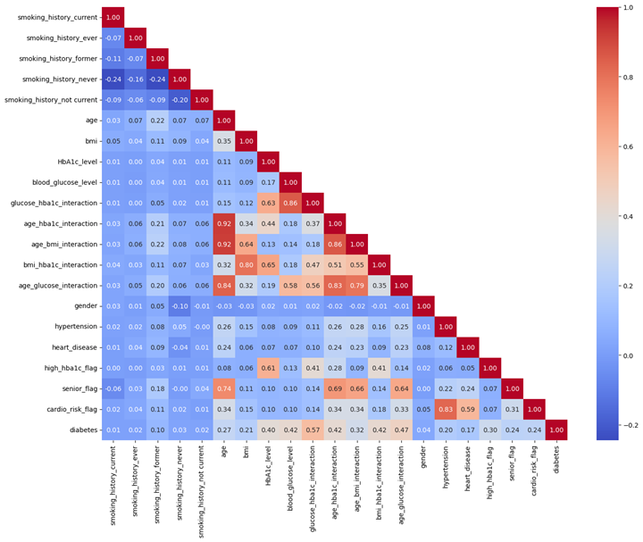
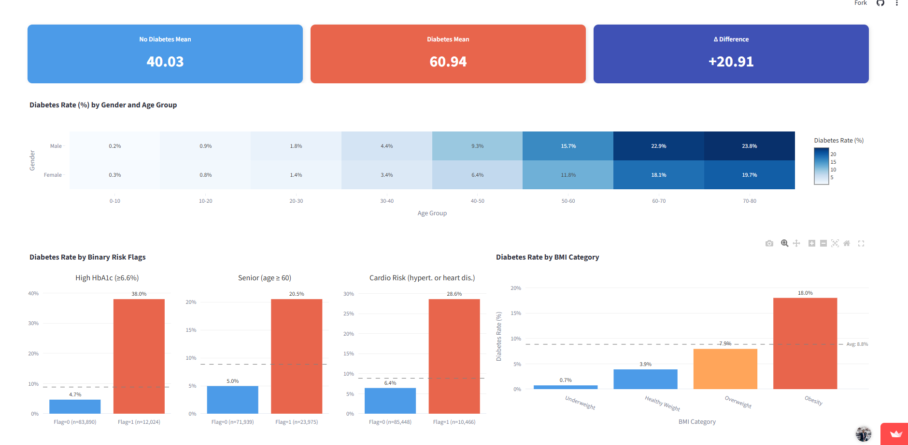
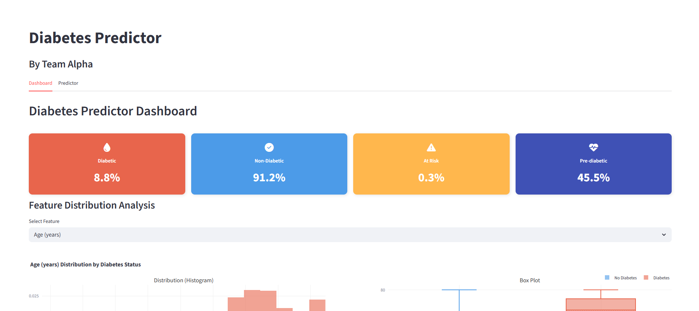
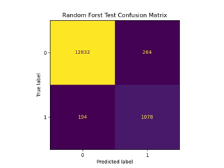
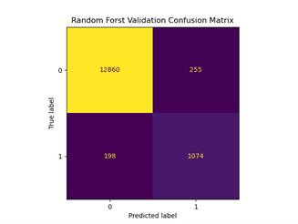
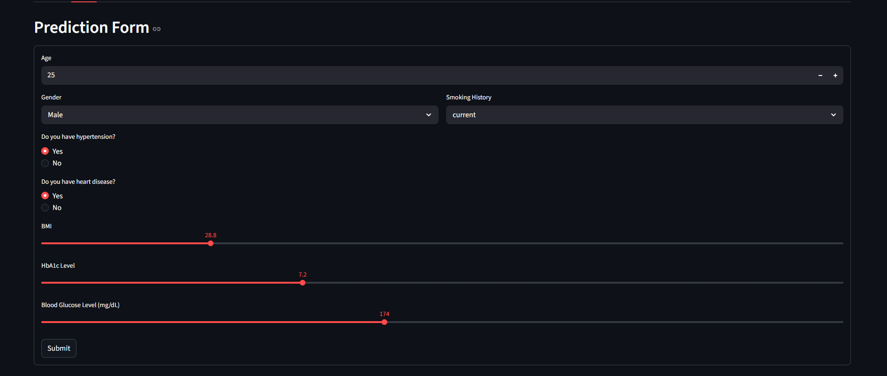
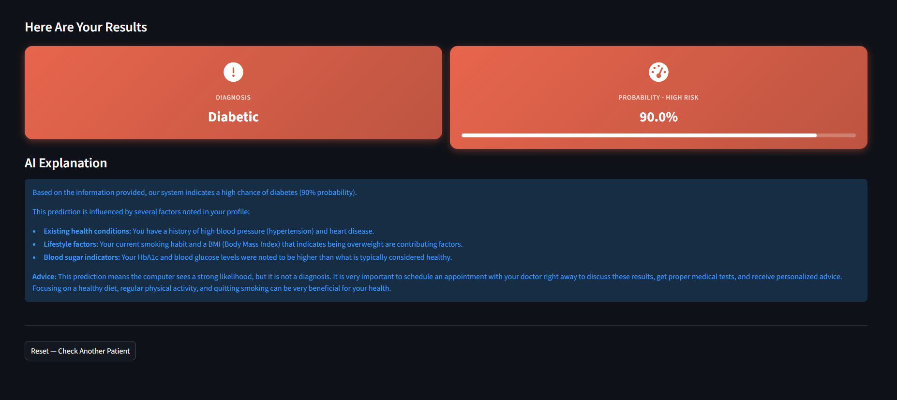

# Diabetes Prediction System

An end-to-end Machine Learning system for early diabetes prediction using clinical and demographic patient data.  

This project was developed as part of the **Applied Data Science (CMPS344)** course at **Cairo University – Faculty of Engineering**.


<p align="center">
  
</p>

---

# Dataset

Dataset used:  
🔗 https://www.kaggle.com/datasets/iammustafatz/diabetes-prediction-dataset

## Raw Dataset Features

| Feature | Description |
|---|---|
| gender | Patient gender |
| age | Patient age |
| hypertension | Hypertension status |
| heart_disease | Heart disease status |
| smoking_history | Smoking history |
| bmi | Body Mass Index |
| HbA1c_level | Average blood sugar level over 3 months |
| blood_glucose_level | Blood glucose measurement |
| diabetes | Target label |

---

## Key Results

| Metric | Score |
|---|---|
| Accuracy | 96.59% |
| Precision | 78.42% |
| Recall | 84.83% |
| F1-Score | 81.50% |
| ROC-AUC | 98.30% |
| PR-AUC | 91.56% |

---

## Tech Stack

- Python
- Scikit-Learn
- MLflow
- FastAPI
- Streamlit
- Pytest
- GitHub Actions
- Poetry

---

# Project Overview

Diabetes is one of the fastest-growing chronic diseases worldwide. Early detection allows healthcare providers to intervene before severe complications occur, reducing long-term healthcare costs and improving patient outcomes.

This project aims to predict whether a patient has diabetes using demographic information, medical history, and clinical measurements.

The system was designed as a complete production-oriented ML pipeline rather than only a standalone notebook model.

---

# Business Problem

Given a patient's clinical and demographic profile, can we accurately predict whether the patient has diabetes?

The system is intended to function as an early screening tool to assist physicians during routine medical checkups.

---

# Stakeholders

- Primary-care physicians
- Hospital outpatient clinics
- Healthcare administrators
- Patients

---

# Dataset Overview

| Attribute | Details |
|---|---|
| Dataset | Diabetes Prediction Dataset |
| Source | Kaggle |
| Records | 100,000 |
| Features | 9 |
| Target | Binary Classification |
| Positive Class Ratio | 8.5% |

---

# Machine Learning Pipeline


The project follows a complete machine learning lifecycle:

```text
→ Data Acquisition
→ Data Validation
→ Data Cleaning
→ Data Preprocessing and Transformation
→ Model Training, Evaluation
→ Experiment Tracking
→ Testing
→ Deployment
→ Streamlit Application
```

---

# Data Validation

A dedicated validation pipeline was implemented before training to ensure data quality and consistency.

## Validation Checks

- Invalid categorical values
- Duplicate records
- Impossible medical records
- Missing values
- Outlier detection
- Distribution analysis
- Consistency checks

## Validation Findings

| Issue | Count |
|---|---|
| Duplicate Records | 3854 |
| Invalid Gender Values | 18 |
| Smoking Inconsistencies | 214 |
| Missing Values | 0 |

---

# Data Cleaning

Several preprocessing decisions were made based on clinical and statistical reasoning.

## Cleaning Steps

### Removed Invalid Gender Records
- Removed 18 invalid records labeled as `Other`

### Removed Impossible Medical Records
- Removed patients under age 10 with smoking history

### Removed Exact Duplicates
- Removed 3854 duplicate rows

### Retained Clinical Outliers
Outliers were intentionally preserved because extremely high values often indicate diabetic conditions and carry meaningful information.

---

# Data Splitting

The dataset was split using stratified sampling to preserve class distribution across all subsets.

| Split | Samples | Percentage |
|---|---|---|
| Training | 67,139 | 70% |
| Validation | 14,387 | 15% |
| Test | 14,388 | 15% |

---

# Feature Engineering


## Engineered Interaction Features

| Feature | Description |
|---|---|
| glucose_hba1c_interaction | Combines short-term and long-term glucose indicators |
| age_hba1c_interaction | Captures age-dependent glucose risk |
| age_bmi_interaction | Encodes obesity risk progression with age |
| bmi_hba1c_interaction | Combines obesity and glucose control |
| age_glucose_interaction | Reflects glucose severity across age groups |

---

## Binary Risk Flags

| Feature | Condition |
|---|---|
| high_hba1c_flag | HbA1c >= 6.5 |
| senior_flag | Age >= 60 |
| cardio_risk_flag | Hypertension OR Heart Disease |

---

# Feature Transformation

## Encoding

### Gender Encoding
- Female → 0
- Male → 1

### Smoking History Encoding
- One-Hot Encoding with category dropping

---

## Feature Scaling

| Feature Type | Scaling Technique |
|---|---|
| BMI / HbA1c / Glucose / Interactions | RobustScaler |
| Age | MinMaxScaler |

---

# Feature Selection

Correlation analysis was used to reduce redundancy and multicollinearity.

<p align="center">
  
</p>

## Final Feature Reduction

| Stage | Number of Features |
|---|---|
| Before Engineering | 9 |
| After Engineering | 20 |
| Final Selected Features | 15 |

---

# Data Balancing

The dataset was highly imbalanced:

| Class | Percentage |
|---|---|
| Non-Diabetic | 91.5% |
| Diabetic | 8.5% |

## Evaluated Balancing Techniques

- SMOTE
- SMOTEENN
- SMOTETomek
- ADASYN

Different balancing strategies were tested with different models.

---

# Exploratory Data Analysis

Several visual analyses were conducted to better understand the relationship between clinical variables and diabetes risk.

## Dashboard

<p align="center">
  
</p>

<p align="center">
  
</p>

---

# Model Training

A total of 8 machine learning models were trained and evaluated.

## Trained Models

- Logistic Regression (Baseline)
- Random Forest
- XGBoost
- LightGBM
- SVM
- KNN
- Decision Tree
- CatBoost

---

# Experiment Tracking with MLflow

MLflow was used to track:

- Model metrics
- Hyperparameters
- Experiments
- Training runs
- Model comparison

<p align="center">
  
</p>

---

# Final Model — Random Forest

Random Forest was selected as the final model because it achieved the best balance between recall, precision, stability, and generalization.

## Why Random Forest?

- Strong performance on structured medical data
- Reduced overfitting through ensemble averaging
- Handles feature interactions effectively
- Stable and interpretable performance

---

## Balancing Strategy Comparison

| Experiment | Accuracy | Precision | Recall | F1 |
|---|---|---|---|---|
| Random Forest - Transformed | 0.9697 | 0.9428 | 0.6997 | 0.8032 |
| Random Forest - ADASYN | 0.9679 | 0.8009 | 0.8475 | 0.8235 |
| Random Forest - SMOTE | 0.9343 | 0.5832 | 0.9009 | 0.7081 |
| Random Forest - SMOTETomek | 0.9698 | 0.8262 | 0.8333 | 0.8297 |

ADASYN was selected as the balancing strategy for the final model.

---

## Hyperparameter Tuning

Several Random Forest configurations were evaluated to optimize recall and F1-score while maintaining strong generalization.

### Final Selected Parameters

| Parameter | Value |
|---|---|
| n_estimators | 100 |
| max_depth | None |
| min_samples_split | 2 |
| min_samples_leaf | 1 |
| class_weight | None |
| random_state | 42 |
| n_jobs | -1 |

---

## Final Results

| Split | Accuracy | Precision | Recall | F1-Score | ROC-AUC |
|---|---|---|---|---|---|
| Validation | 0.9679 | 0.8009 | 0.8475 | 0.8235 | 0.9841 |
| Test | 0.9659 | 0.7842 | 0.8483 | 0.8150 | 0.9830 |

---

## Confusion Matrix

<p align="center">
  
</p>

<p align="center">
  
</p>

---


# CI/CD Pipeline

GitHub Actions were used to automate project quality checks.

## Automated Steps

- Code formatting using Black
- Linting using Ruff
- Unit testing with Pytest
- Pipeline verification


---

# Deployment

The project was deployed as a complete ML application.

---

# FastAPI Backend

The backend provides:

- Model inference API
- Input validation
- Preprocessing pipeline integration
- Model prediction
- AI-generated medical insights

---

# Streamlit Application

The Streamlit application includes:

- Interactive dashboard
- Data visualizations
- Real-time prediction form


---

## Prediction Form

<p align="center">
  
</p>

---

# AI-Powered Health Insights

The application integrates Google Gemini to generate:

- Prediction explanations
- Patient risk interpretation
- Personalized health insights
- Lifestyle recommendations

<p align="center">
  
</p>

---

# Results & Business Impact

The system correctly identifies approximately 85 out of every 100 diabetic patients.

## Why Recall Matters

In medical screening:
- False negatives are extremely dangerous
- Missing diabetic patients delays treatment
- Early detection reduces long-term complications

The selected model achieves high recall while maintaining strong precision and overall stability.

---

# Installation

## Clone Repository

```bash
git clone <repo-url>
cd diabetes-prediction
```

---

## Install Dependencies

```bash
poetry install
```

---

# Running the Project

## Run FastAPI Backend

```bash
uvicorn src.main:app --reload
```

---

## Run Streamlit App

```bash
streamlit run streamlit_app/app.py
```

---

# Application Demo

## Live Streamlit App

[Open Application](https://diabetes-prediction-alpha-team.streamlit.app/)

---

# Contributors

- Ahmed Mohamed — [@Ahmedianoo](https://github.com/Ahmedianoo)
- Karim Mahmoud — [@KarimHegab698](https://github.com/KarimHegab698)
- Seif Eldin Mohamed Ahmed Sayed — [@EngSeif](https://github.com/EngSeif)
- Amr Ashraf Ali — [@amrashraf15](https://github.com/amrashraf15)

---
